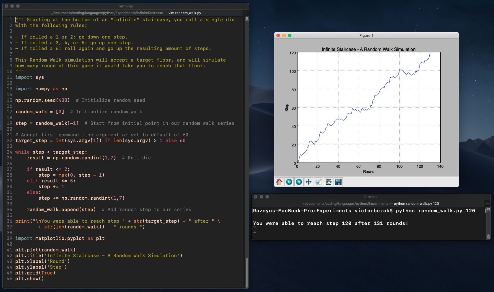

# Infinite Staircase - A Random Walk Simulation

Simulating a random walk to find the number of die rolls (each result corresponding to an instruction) it would take to reach a given step of an infinite staircase.

Can accept a target step as a command-line argument, or will default to 60.

